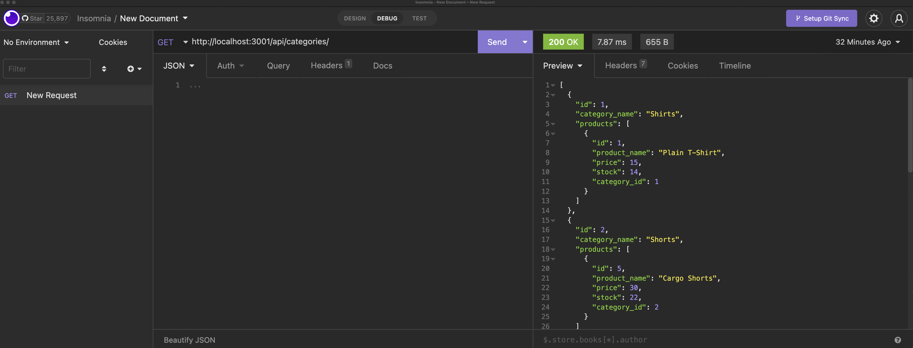

# E-Commerce-Backend

### **GitHub Repository:**

https://github.com/Jimmy-Vela06/E-Commerce-BackEnd

## []

## **Table of Contents:**

### [Description](#description)

### [DevDependencies](#devdependencies)

### [Installation](#installation)

### [Usage](#usage)

### [Image](#image)

### [License](#license)

### [Questions](#questions)

## **Description:**

AS A manager at an internet retail company,
I WANT a back end for my e-commerce website that uses the latest technologies,
SO THAT my company can compete with other e-commerce companies.

## **DevDependencies:**

- nodemon: "^2.0.3"
- dotenv: "^8.2.0"
- express: "^4.17.1",
- mysql2: "^2.1.0",
- sequelize: "^5.21.7"

## **Installation:**

npm install

## **Usage:**

Once the database has been sourced and seeded through mysql the user will run in the CLI 'npm run start'. The server will be connected to localhost. Using insomnia to tes the api routes for categories, products and tags. The user can post, update, delete or retrieve information from the api routes.

## **Image:**

## **License:**

### MIT License

Copyright (c) 2023 Jimmy Vela Jr.

Permission is hereby granted, free of charge, to any person obtaining a copy
of this software and associated documentation files (the "Software"), to deal
in the Software without restriction, including without limitation the rights
to use, copy, modify, merge, publish, distribute, sublicense, and/or sell
copies of the Software, and to permit persons to whom the Software is
furnished to do so, subject to the following conditions:

The above copyright notice and this permission notice shall be included in all
copies or substantial portions of the Software.

THE SOFTWARE IS PROVIDED "AS IS", WITHOUT WARRANTY OF ANY KIND, EXPRESS OR
IMPLIED, INCLUDING BUT NOT LIMITED TO THE WARRANTIES OF MERCHANTABILITY,
FITNESS FOR A PARTICULAR PURPOSE AND NONINFRINGEMENT. IN NO EVENT SHALL THE
AUTHORS OR COPYRIGHT HOLDERS BE LIABLE FOR ANY CLAIM, DAMAGES OR OTHER
LIABILITY, WHETHER IN AN ACTION OF CONTRACT, TORT OR OTHERWISE, ARISING FROM,
OUT OF OR IN CONNECTION WITH THE SOFTWARE OR THE USE OR OTHER DEALINGS IN THE
SOFTWARE.

## **Questions:**

If you have any contacat the following
Email: <jimmyvela06@gmail.com>
